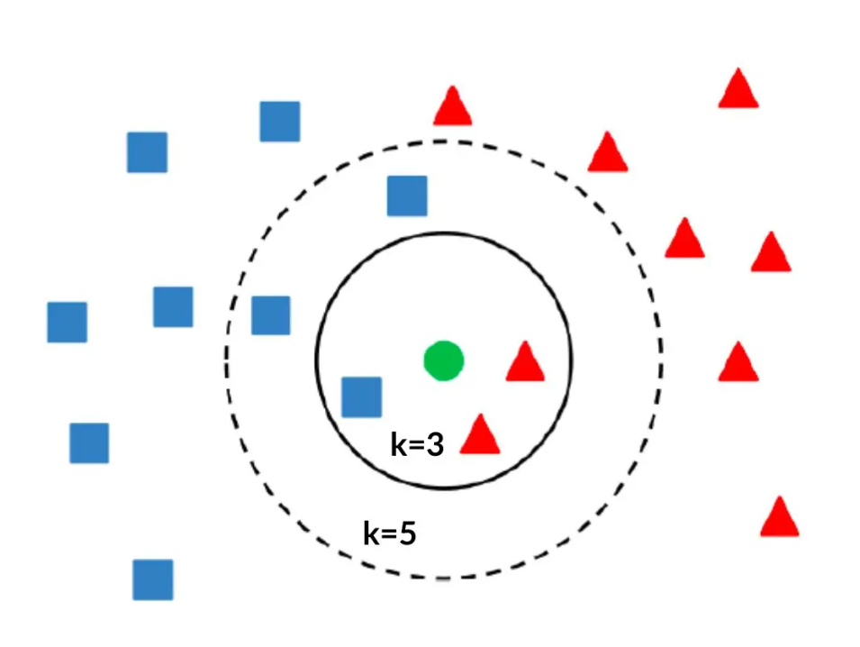

# Machine Learning

Machine Learning course at Londrina State University, taught by Dr. Gustavo T. Naozuka.

This repository contains exercises and assignments from the course, all of which were developed entirely by me without AI-generated code.

Questions or suggestions are welcome.

# Exercises

## [K-Nearest Neighbors](../src/k_nearest_neighbors)

This project implements the K-Nearest Neighbors (KNN) algorithm, a machine learning method used for classification.

It features a custom KNN class that can predict the class of a given point in an n-dimensional space based on its 'k' nearest neighbors. The function is flexible, supporting several distance metrics: _Euclidean_, _Manhattan_, and _Minkowski_ (for any given p-value). It also includes an optional feature for distance-weighted voting, where closer neighbors have a greater influence on the final classification. This weighting is automatically applied to resolve ties if the standard voting method results in a draw.

## [Gradient Descent](../src/gradient_descent)

This project implements the Gradient Descent algorithm for logistic regression, a machine learning method to minimize a cost function.

It features a custom GradientDescentCalculator class that calculates the sigmoid curve and the estimated beta values based on a training set.
